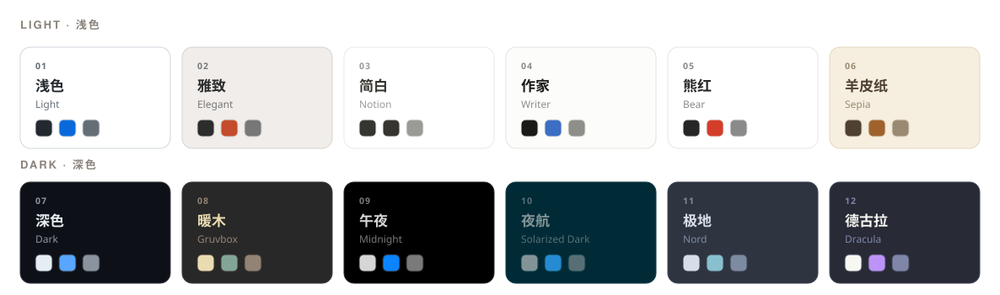

# ColaMD Melody

> Melody 独立维护的 macOS Markdown 编辑器，支持 AI Agent 改动实时同步。

**Language / 语言: [English](README.md) · [中文](README_CN.md)** · [上游 ColaMD](https://github.com/marswaveai/ColaMD)

ColaMD Melody 是一款面向 Apple Silicon Mac 的开源、轻量 Markdown 编辑器，用于写作、记录和文档。它是 [marswave.ai 原版 ColaMD](https://github.com/marswaveai/ColaMD) 的独立维护分支，继续遵循并保留原项目的 MIT License。

它支持所见即所得、主题切换、富文本复制、智能换行、PDF 与 HTML 导出，以及接近访达/Obsidian 使用习惯的层级文件栏。

当 Claude Code、Codex、Cola 或其他 Agent 修改正在打开的 `.md` 文件时，ColaMD 会实时同步改动。

[下载](#下载) | [功能](#功能)

---

## 截图

  
  

<em>内置语法速查、交互式待办列表、代码块、引用、表格与智能换行。</em>

## 主题

12 个内置主题——6 浅 6 深，灵感来自 Bear、Notion、iA Writer、Kindle、Solarized、Nord、Gruvbox 和 Dracula。

  

## 功能

- **实时 Agent 同步** — Claude Code、Cursor、Copilot 或其他 AI Agent 修改文件后，内容实时出现在编辑器中。
- **Agent 活动指示器** — 标题栏小圆点显示 Agent 正在写入或已经完成。
- **真正的所见即所得** — 输入 Markdown，直接看到富文本，无需分屏预览。
- **按需加载的层级文件树** — 文件夹在原位置展开/收起，不再进入后替换整张列表。每个窗口只保留一个会话级根目录，仅读取和监听已展开目录。
- **访达式文件操作** — 右击可新建或删除 Markdown 文档与文件夹、创建文件副本，也可直接导出所选 Markdown 为 PDF 或 HTML；删除统一移到 macOS 废纸篓。
- **源码模式** — 需要查看或直接修改原始 Markdown 时，一键切换源码编辑。
- **待办列表** — 直接点击复选框完成任务，也支持快捷键。
- **高亮与 LaTeX** — 使用 `==高亮文本==`，并通过 KaTeX 渲染数学公式。
- **文档搜索** — 使用 ⌘/Ctrl+F 快速查找内容。
- **智能换行** — 单个换行直接渲染为换行，符合人类和 AI 工具写 Markdown 的习惯。
- **富文本复制** — 复制后粘贴到公众号、微信、邮件等富文本编辑器，格式完整保留。
- **主题** — 12 个内置主题，在浅色和深色环境中专注写作。
- **PDF 与 HTML 导出** — 可从“文件”菜单导出当前文档，也可从右键菜单直接导出所选文件。
- **图片路径可移植保存** — 本地图片显示使用安全的 `file://` URL，保存时恢复为相对路径。
- **VS Code 集成** — 在 VS Code 中将当前 Markdown 文件直接打开到 ColaMD。
- **极简设计** — 没有工具栏，没有永久侧边栏，专注于内容本身。
- **macOS Apple Silicon** — Melody 独立版只构建和发布 macOS arm64。

## 与现有 Markdown 工作流配合

ColaMD 不要求你改变现有习惯，也适合与 Obsidian、Typora、VS Code 等 Markdown 软件配合使用。它们共享同一套 `.md` 文件，你可以用不同工具完成不同任务。

## 下载

> v1.9.0 仍在开发，尚未发布。经 Melody 确认发布后，完成签名与 Notarization 的 Apple Silicon 安装包会出现在 [Releases](https://github.com/MelodyTung888/ColaMD/releases)。

| 平台 | 架构 | 格式 |
|------|------|------|
| macOS | Apple Silicon（`arm64`） | `.dmg` / `.zip` |

## 路线图

ColaMD 将随 Agent 生态一起演进：

- v1.1 — 实时文件热更新、文件关联、拖拽打开、主题系统
- v1.2 — 新图标
- v1.3 — Agent 活动指示器、Cmd+点击链接、富文本复制、智能换行、PDF 导出、主题持久化
- v1.6 — 更稳的实时同步：原子保存（rename）检测、watcher 自愈、关闭拼写检查
- v1.6.1 — 可勾选的待办列表（点击 / ⌘+Enter）、`==高亮==` 语法、Markdown 语法速查
- v1.6.2 — 暂时移除 HTML 导出
- v1.7 — 同目录文件列表：就地切换文件，Agent 新建/删除文件实时更新；搜索（⌘F）+ LaTeX（⌘⇧E），来自社区 PR #14
- v1.7.1 — 待办点击修复、居中的 SVG 对勾、标题栏文件面板开关按钮
- v1.7.2 — 可玩演示页：Help → 新功能演示（⌘⇧D），用真实目录展示每个版本的新功能
- v1.7.3 — 演示页升级为累积式 changelog：resources/demo/changelog.md 记录每个版本，打开即见
- v1.7.4 — 根据社区反馈完善文件面板、源码模式、HTML 导出、Windows 图片路径，并提供 VS Code 集成 MVP
- v1.8.0 — Markdown 与 HTML 本地图片均可移植保存，并完成社区反馈中的编辑修复
- v1.8.1 — 优化首次启动体验和 macOS 图标；移除 Mermaid 渲染，代码块恢复为原生可编辑体验
- v1.8.2 — 12 个内置主题，包含 6 个浅色与 6 个深色主题
- v1.9.0（开发中）— ColaMD Melody 独立身份、更宽的编辑器滚动条、按需加载的层级文件树、访达式文件操作和右键 PDF/HTML 导出
- 未来 — 更多主题、编辑器集成与 Markdown 工作流优化

## 开源协议

[MIT](LICENSE) — 永久免费，并保留原版 ColaMD 的版权与许可声明。

---

ColaMD Melody 由 [MelodyTung888](https://github.com/MelodyTung888) 独立维护，基于 [marswave.ai](https://marswave.ai) 的原版 [ColaMD](https://github.com/marswaveai/ColaMD)。
